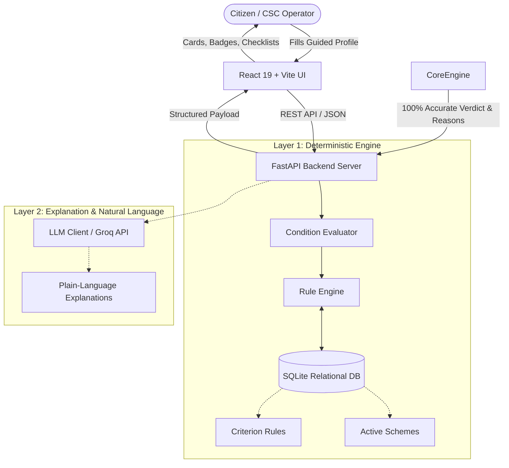

# Scheme_Checker

# 🏛️ SchemeChecker — Government Scheme Eligibility Engine

> **A deterministic, citizen-friendly platform that screens individuals across multiple government welfare schemes in under 2 seconds with zero hallucinations.**

[](https://fastapi.tiangolo.com)
[](https://react.dev)
[](https://vitejs.dev)
[](https://www.python.org)
[](https://www.sqlite.org)
[](https://opensource.org/licenses/MIT)

---

## 📌 Problem Statement

Every year, the Government of India and various state administrations allocate hundreds of thousands of crores to welfare programs covering agriculture, housing, education, and social pensions. 

Yet, **over 70% of eligible rural and lower-income citizens miss out on their rightful benefits** due to:
1. **Fragmented Information:** Criteria and notifications are scattered across dozens of individual ministry websites.
2. **Complex Legal Terminology:** Welfare circulars are written in dense administrative language that citizens cannot easily decipher.
3. **Middlemen & Exploitation:** Lack of direct eligibility awareness forces citizens to pay intermediaries for basic application assistance.

**SchemeChecker** solves this by providing a single-window portal where a citizen enters their basic profile once and instantly receives an accurate, transparent eligibility report with actionable document checklists and official application links.

---

## 💡 Key Architectural Innovation: The Dual-Engine Approach

Most conventional welfare chatbots use generic vector search (RAG) directly connected to an LLM. However, LLMs are probabilistic and frequently hallucinate mathematical and legal thresholds (such as determining whether `income <= ₹2,50,000` combined with specific category and age constraints).

**SchemeChecker replaces guesswork with a robust two-layer architecture:**



1. **Layer 1: Deterministic Rule Engine (The Decider)**
   - Evaluates citizen profiles against scheme rules using exact logical, mathematical, and set operators (`=`, `!=`, `>`, `>=`, `<`, `<=`, `IN`, `NOT IN`).
   - Generates exact pass/fail reasons for each specific rule.
   - **Zero hallucination, 100% mathematically verifiable.**

2. **Layer 2: AI Assistance Layer (The Explainer & Extractor)**
   - Translates technical rule results into empathetic, easy-to-understand explanations.
   - Extracts structured parameters from natural language descriptions when requested.
   - **Never overrides or calculates eligibility decisions.**

---

## ✨ Features

- 📋 **Guided Citizen Profile Form:** Form fields for age, gender, state, district, area (Rural/Urban), social category, annual income, occupation, and household indicators.
- ⚡ **Smart Auto-Inference:** Entering *"Farmer"* automatically flags land and agricultural worker indicators; entering *"Student"* flags scholarship-related fields.
- 🎯 **Instant Multi-Scheme Screening:** Evaluates multiple schemes simultaneously in under 2 seconds.
- 🏷️ **Visual Status Badges:** Color-coded status tags for **Eligible** (Green), **Partially Eligible** (Amber), and **Not Eligible** (Crimson).
- 🔍 **Live Multi-Attribute Filtering:** Filter results in real-time by keyword search, scheme category, or eligibility outcome.
- 📄 **Required Document Checklist:** Outlines essential paperwork (Aadhaar, Land Records, Income Certificate, Bank Details) for each scheme.
- 🔗 **Direct Official Portal Integration:** One-click links directly to official government portals (e.g., `pmkisan.gov.in`, `pmayg.nic.in`, `scholarships.gov.in`).
- 🕒 **Audit & History Tracking:** Automatically saves past checks with full snapshot data, allowing citizens or Common Service Center (CSC) operators to review, re-evaluate, or delete history items.

---

## 🏛️ Supported Schemes (Out of the Box)

| Scheme Code | Scheme Name | Ministry / Department | Category | Key Eligibility Criteria |
| :--- | :--- | :--- | :--- | :--- |
| **`PM_KISAN`** | Pradhan Mantri Kisan Samman Nidhi | Ministry of Agriculture & Farmers Welfare | Agriculture | Farmer = `True`, Land Ownership = `True`, Age ≥ `18` |
| **`PMAY_G`** | Pradhan Mantri Awaas Yojana - Gramin | Ministry of Rural Development | Housing | Area = `Rural`, Pucca House Ownership = `False`, Age ≥ `18` |
| **`NSP_POST_MATRIC`** | Post-Matric Scholarship Scheme | Ministry of Social Justice / Tribal Affairs | Education | Student = `True`, Education in `[Class 11-12, Diploma, UG, PG]`, Income ≤ `₹2,50,000`, Category in `[SC, ST, OBC]` |
| **`PM_SVANIDHI`** | PM Street Vendor's AtmaNirbhar Nidhi | Ministry of Housing and Urban Affairs | Self Employment | Street Vendor = `True`, Employment = `Self-employed`, Age ≥ `18` |
| **`NSAP_IGNOAPS`** | Indira Gandhi National Old Age Pension | Ministry of Rural Development | Social Security | Age ≥ `60`, BPL Card Status = `True` |

---

## 📂 Project Structure

```text
Goverment Scheme Eligibility Check/
│
├── README.md                           # Project documentation
│
├── backend/                            # FastAPI Python Backend
│   ├── .env                            # Environment variables (GROQ_API_KEY, etc.)
│   ├── main.py                         # Application entrypoint & CORS configuration
│   └── app/
│       ├── ai/                         # AI & LLM integration modules
│       │   ├── explanation_generator.py
│       │   ├── llm_client.py
│       │   └── profile_extractor.py
│       ├── api/                        # API route handlers & dependencies
│       │   ├── dependencies.py
│       │   └── routes/
│       │       ├── eligibility.py      # /api/eligibility endpoints
│       │       ├── health.py           # /api/health endpoints
│       │       ├── profile.py          # /api/profile & /history endpoints
│       │       └── schemes.py          # /api/schemes endpoints
│       ├── config/                     # Application settings & logging
│       │   ├── logging.py
│       │   └── settings.py
│       ├── data/                       # Seed definitions
│       │   ├── fields.json
│       │   ├── rules.json
│       │   └── schemes.json
│       ├── database/                   # Database models & CRUD
│       │   ├── crud.py                 # Abstracted DB operations
│       │   ├── database.py             # Engine, SessionLocal & init_db
│       │   └── seed.py                 # Automated DB population script
│       ├── engine/                     # Core deterministic rule logic
│       │   ├── condition_evaluator.py  # Type-safe operator evaluation
│       │   ├── rule_engine.py          # Scheme evaluation & metadata enrichment
│       │   └── rule_registry.py        # Database-driven rule access
│       ├── models/                     # SQLAlchemy ORM Models
│       │   ├── eligibility_result.py
│       │   ├── rule.py
│       │   ├── scheme.py
│       │   └── user.py
│       ├── schemas/                    # Pydantic validation schemas
│       │   ├── eligibility.py
│       │   ├── scheme.py
│       │   └── user.py
│       ├── services/                   # Business logic layer
│       │   ├── eligibility_service.py
│       │   ├── explanation_service.py
│       │   ├── recommendation_service.py
│       │   └── scheme_service.py
│       └── utils/                      # Helper formatters & validators
│           ├── formatters.py
│           └── validators.py
│
└── frontend/                           # React + Vite Client Application
    ├── index.html                      # HTML5 entrypoint
    ├── package.json                    # Dependencies & build scripts
    ├── vite.config.js                  # Vite server & backend API proxy
    └── src/
        ├── App.jsx                     # Route configurations & layout navbar
        ├── index.css                   # Custom responsive civic design system
        ├── main.jsx                    # React root renderer
        ├── components/                 # Reusable UI components
        │   ├── EligibilityBadge.jsx    # Status indicators (Eligible/Partial/Ineligible)
        │   ├── EligibilityReason.jsx   # Structured criteria explanation block
        │   ├── FilterBar.jsx           # Search, category, and status filters
        │   ├── ProfileForm.jsx         # Guided profile entry with auto-inference
        │   └── SchemeCard.jsx          # Scheme display cards with actions
        ├── hooks/                      # Custom React hooks
        │   └── useEligibility.js
        ├── pages/                      # Page components
        │   ├── CheckEligibility.jsx    # Profile entry page
        │   ├── History.jsx             # Eligibility audit history page
        │   ├── Home.jsx                # Landing & overview page
        │   ├── Results.jsx             # Evaluated schemes result page
        │   └── SchemeDetails.jsx       # Individual scheme deep-dive page
        ├── services/                   # Centralized API service layer
        │   └── api.js
        └── utils/                      # Client-side validation
            └── validation.js
```

---

## 🚀 Getting Started

### Prerequisites
- **Python:** 3.10 or higher
- **Node.js:** 18.0 or higher
- **npm:** 9.0 or higher

---

### 1. Backend Setup

1. Open a terminal and navigate to the `backend` folder:
   ```bash
   cd backend
   ```

2. (Optional but recommended) Create and activate a virtual environment:
   ```bash
   # Windows
   python -m venv venv
   .\venv\Scripts\activate

   # macOS / Linux
   python3 -m venv venv
   source venv/bin/activate
   ```

3. Install required Python packages:
   ```bash
   pip install fastapi uvicorn sqlalchemy pydantic pydantic-settings python-dotenv
   ```
   *(Optional for AI features: `pip install groq`)*

4. Seed the database with initial schemes and rules:
   ```bash
   python -m app.database.seed
   ```
   *Expected Output: `Database seeding completed successfully.`*

5. Start the FastAPI server:
   ```bash
   uvicorn main:app --reload --port 8000
   ```
   - API will be live at: **`http://localhost:8000`**
   - Interactive Swagger API Documentation: **`http://localhost:8000/docs`**

---

### 2. Frontend Setup

1. Open a **new, separate terminal** and navigate to the `frontend` folder:
   ```bash
   cd frontend
   ```

2. Install dependencies:
   ```bash
   npm install
   ```

3. Start the Vite development server:
   ```bash
   npm run dev
   ```

4. Open your browser and visit:
   👉 **`http://localhost:5173`**

---

## 📡 API Reference

| Method | Endpoint | Description |
| :--- | :--- | :--- |
| `GET` | `/api/health` | Service health status check |
| `GET` | `/api/health/database` | Database connectivity verification |
| `GET` | `/api/schemes` | List all active government schemes (supports `search`, `category`, `state` filters) |
| `GET` | `/api/schemes/{scheme_id}` | Retrieve full details of a specific scheme |
| `GET` | `/api/schemes/{scheme_id}/rules` | Retrieve rules configured for a scheme |
| `POST` | `/api/eligibility/check` | Batch evaluation of citizen profile against all active schemes |
| `POST` | `/api/eligibility/check/{scheme_id}` | Evaluate eligibility for a specific single scheme |
| `POST` | `/api/eligibility/explain` | Evaluate scheme and generate AI-based plain-language explanation |
| `POST` | `/api/profile` | Create a persistent citizen profile in the database |
| `GET` | `/api/profile/{user_id}` | Retrieve citizen profile by ID |
| `PUT` | `/api/profile/{user_id}` | Update citizen profile |
| `GET` | `/api/profile/{user_id}/eligibility`| Run eligibility on a stored citizen profile |
| `GET` | `/api/profile/history` | Retrieve past eligibility screening audit records |
| `DELETE`| `/api/profile/history/{id}` | Delete a history audit record |

### Sample Eligibility Check Request:
`POST /api/eligibility/check`
```json
{
  "name": "Ramesh Kumar",
  "age": 42,
  "gender": "male",
  "state": "Uttar Pradesh",
  "district": "Varanasi",
  "rural_urban": "Rural",
  "category": "General",
  "annual_income": 85000,
  "occupation": "Farmer",
  "farmer": true,
  "land_ownership": true,
  "house_ownership": false,
  "bpl_status": false,
  "student_status": false,
  "street_vendor": false,
  "disability": false
}
```

### Sample Response:
```json
{
  "success": true,
  "total_schemes_checked": 5,
  "results": [
    {
      "scheme_id": "PM_KISAN",
      "name": "Pradhan Mantri Kisan Samman Nidhi",
      "eligible": true,
      "status": "eligible",
      "reason": "You meet all the eligibility criteria for this scheme.",
      "reasons": [
        "Farmer requirement satisfied (= true).",
        "Land Ownership requirement satisfied (= true).",
        "Age requirement satisfied (>= 18)."
      ],
      "benefits": "Financial assistance provided to eligible farmer families.",
      "application_url": "https://pmkisan.gov.in/"
    },
    {
      "scheme_id": "PMAY_G",
      "name": "Pradhan Mantri Awaas Yojana - Gramin",
      "eligible": true,
      "status": "eligible",
      "reason": "You meet all the eligibility criteria for this scheme.",
      "reasons": [
        "Rural Urban requirement satisfied (= Rural).",
        "House Ownership requirement satisfied (= false).",
        "Age requirement satisfied (>= 18)."
      ]
    }
  ]
}
```

---

## 🧪 Testing & Verification

The project includes an end-to-end integration test suite verifying database operations, rule engine accuracy, schema validation, and API contracts:

Run all tests from the `backend/` directory:
```bash
python -c "
from fastapi.testclient import TestClient
from main import app
client = TestClient(app)
assert client.get('/api/health').status_code == 200
assert len(client.get('/api/schemes').json()['schemes']) == 5
print('All critical sanity checks PASSED!')
"
```

To build the frontend for production:
```bash
cd frontend
npm run build
```
*(Builds static assets into `frontend/dist/` in ~1.5 seconds).*

---

## 🛡️ Security & Privacy Considerations

- **No Sensitive PII Mandated:** Citizens do not need to share Aadhaar numbers, PAN cards, or phone numbers to check eligibility.
- **Strict CORS Protection:** Local development uses explicit origin allowances rather than open wildcard credentials.
- **Isolated Evaluation:** Citizen profile data is screened locally against database rules without sending personal identifiers to external LLM APIs.

---

## 👥 Contributors & Acknowledgements

Developed as a Hackathon Project addressing last-mile citizen empowerment and GovTech accessibility.

*Special thanks to open data initiatives and official portals of the Government of India for public scheme parameters.*
